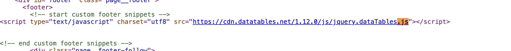
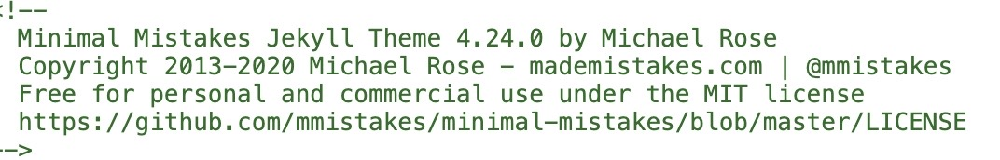
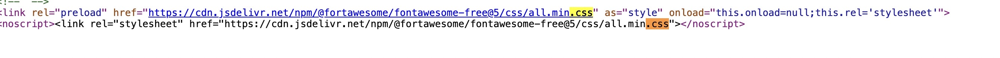
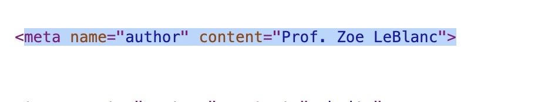

The website I investigated was actually the course website. I used the inspect element and right clicked on the website and clicked "View Page 
Source." This showed me that the website was built by HTML, it also included .css files, and .js files. When checking for who built the website 
and who contributed, i came across a name of "Michael Rose" I was unsure if it is them who built it but the name was the first thing in the 
inspect. I for sure know the author is "Prof. Zoe LeBlanc" since it states it in the code, but I think maybe some elements of the theme were 
created by this Michael individual. 

